# do it — Todo List

할 일 목록을 관리하는 Todo 서비스입니다. 진행 중/완료 항목을 나눠서 관리하고, 상세 페이지에서 메모와 이미지를 함께 남길 수 있습니다.

- **배포**: https://codeit-kappa.vercel.app
- **레포지토리**: https://github.com/H-Min-01/todo-list

## Preview

<details open>
  <summary><strong>목록 — 할 일 있음</strong></summary>
  <br />
  <table>
    <thead>
      <tr>
        <th>Desktop</th>
        <th>Tablet</th>
        <th>Mobile</th>
      </tr>
    </thead>
    <tbody>
      <tr>
        <td>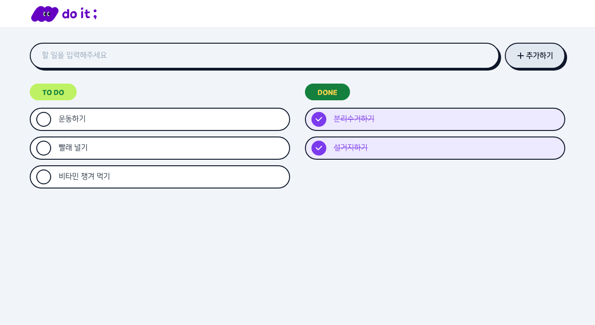</td>
        <td>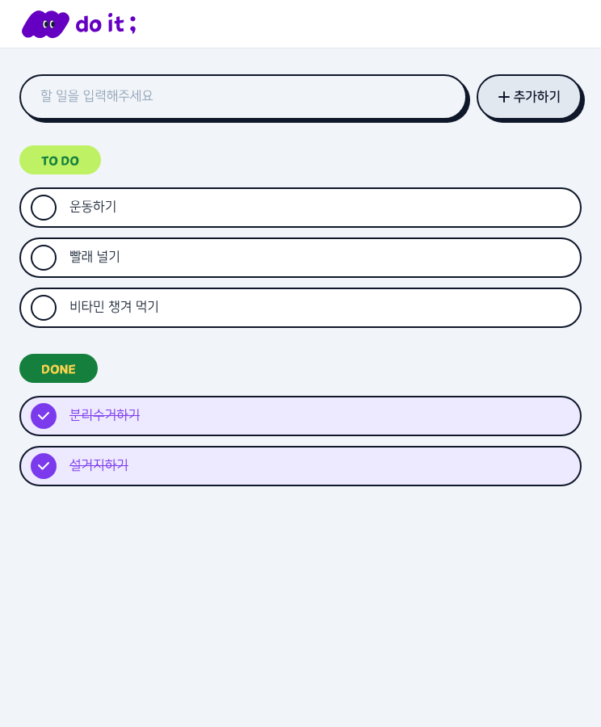</td>
        <td>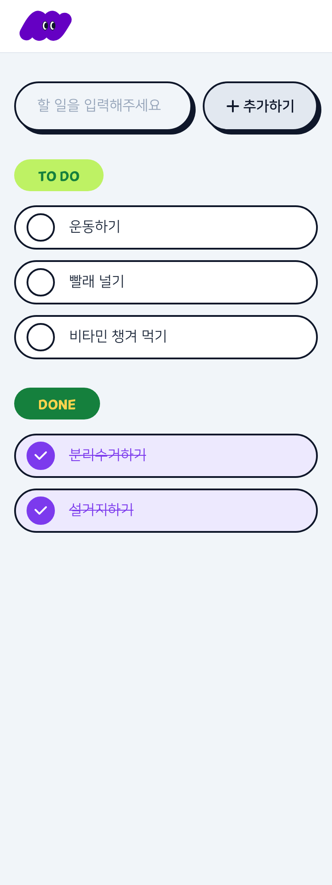</td>
      </tr>
    </tbody>
  </table>
</details>

<details>
  <summary><strong>목록 — 빈 상태</strong></summary>
  <br />
  <table>
    <thead>
      <tr>
        <th>Desktop</th>
        <th>Tablet</th>
        <th>Mobile</th>
      </tr>
    </thead>
    <tbody>
      <tr>
        <td>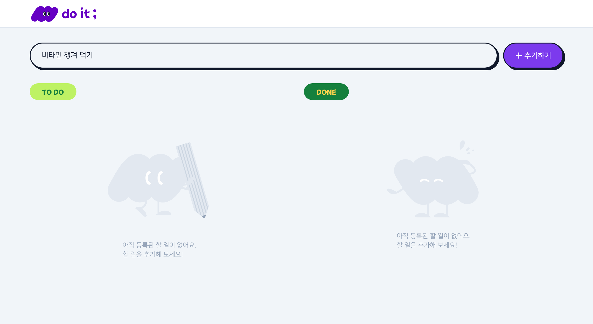</td>
        <td>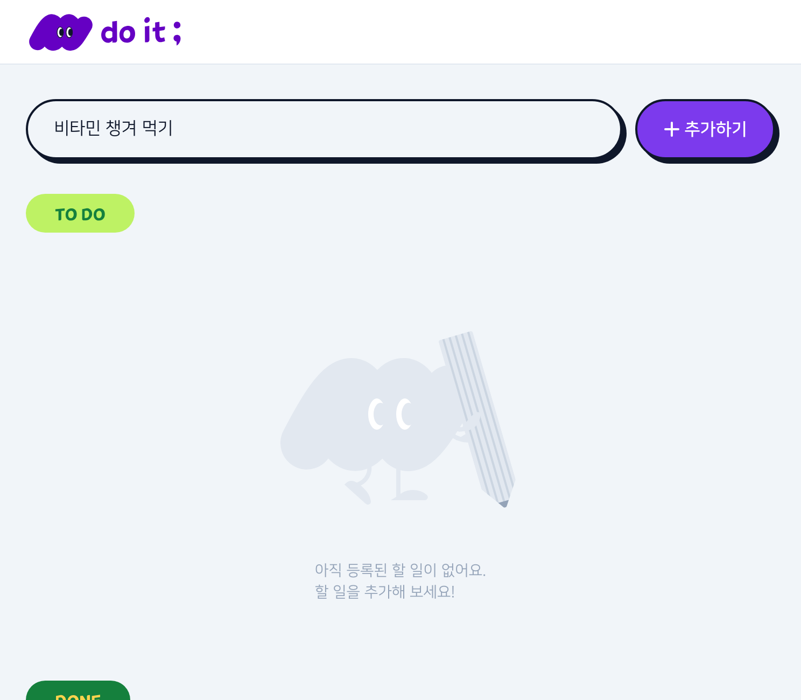</td>
        <td>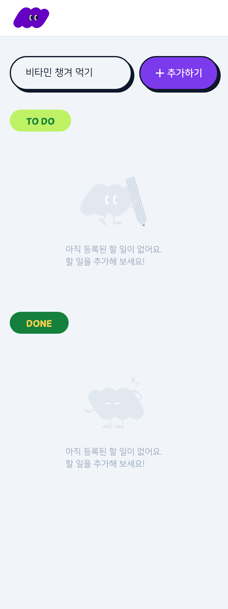</td>
      </tr>
    </tbody>
  </table>
</details>

<details>
  <summary><strong>상세 — 기본 상태</strong></summary>
  <br />
  <table>
    <thead>
      <tr>
        <th>Desktop</th>
        <th>Tablet</th>
        <th>Mobile</th>
      </tr>
    </thead>
    <tbody>
      <tr>
        <td>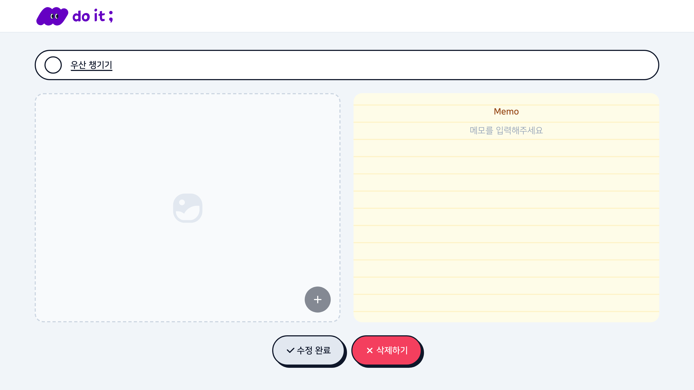</td>
        <td>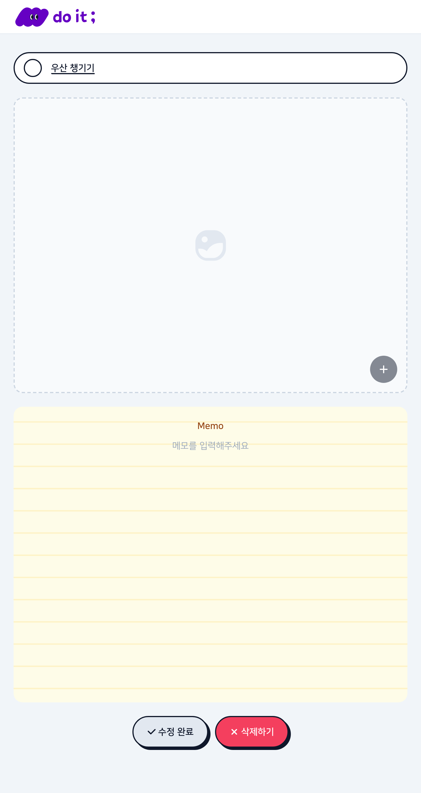</td>
        <td>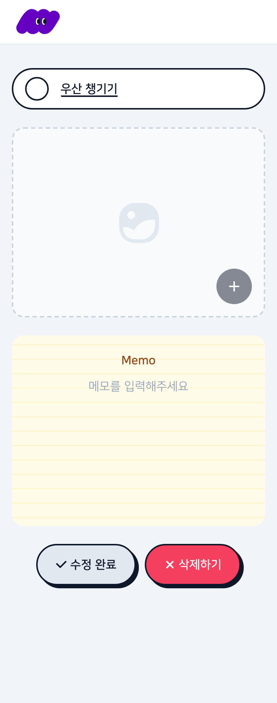</td>
      </tr>
    </tbody>
  </table>
</details>

<details>
  <summary><strong>상세 — 작성/수정 상태</strong></summary>
  <br />
  <table>
    <thead>
      <tr>
        <th>Desktop</th>
        <th>Tablet</th>
        <th>Mobile</th>
      </tr>
    </thead>
    <tbody>
      <tr>
        <td>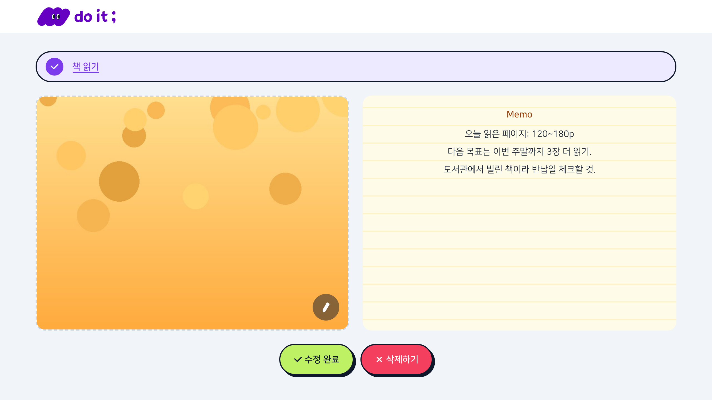</td>
        <td>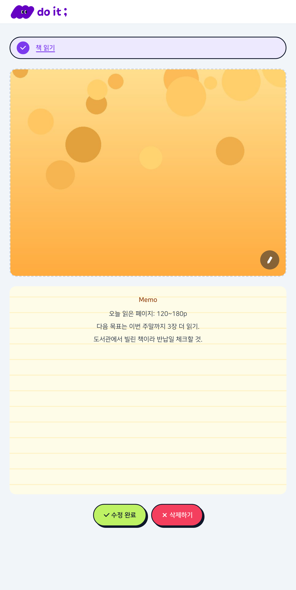</td>
        <td>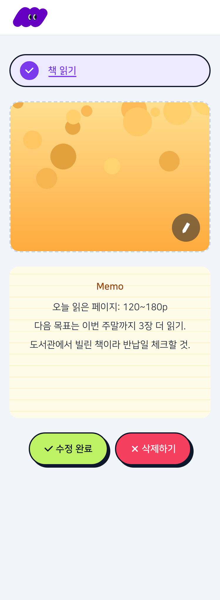</td>
      </tr>
    </tbody>
  </table>
</details>

## 주요 기능

**할 일 목록 (`/`)**
- 진행 중 / 완료 항목 구분 표시
- `추가하기` 버튼 또는 Enter 키로 할 일 추가
- 체크박스로 진행 중 ↔ 완료 상태 토글
- 로고 클릭 시 `/`로 새로고침 이동

**할 일 상세 (`/items/{itemId}`)**
- 이름 / 완료 상태 / 메모 수정
- 이미지 첨부 (최대 1개, 영문 파일명 + 5MB 이하만 허용)
- 수정 완료·삭제 후 목록으로 이동, 재방문 시 저장된 내용 그대로 조회

## 기술 스택

- [Next.js 16](https://nextjs.org) (App Router) + TypeScript
- Tailwind CSS v4
- [assignment-todolist-api](https://assignment-todolist-api.vercel.app/docs/) (REST API)

## 프로젝트 구조

```
src/
  app/
    page.tsx                  # 할 일 목록 페이지
    layout.tsx                 # 루트 레이아웃, 폰트/메타데이터
    globals.css                 # Tailwind 테마 토큰
    items/[itemId]/
      page.tsx                 # 할 일 상세 페이지
      not-found.tsx             # 상세 페이지 404 화면
  components/
    common/                    # 공용 컴포넌트 (Button, TextField, Checkbox, Header)
    todo/                      # 도메인 컴포넌트 (TodoItem, TodoInput, ImageUploadBox, MemoBox 등)
  lib/
    api.ts                     # API 호출 함수
    types.ts                   # API 요청/응답 타입
    fonts.ts                   # 웹폰트 설정
    useKeyboardFocus.ts         # 키보드/마우스 입력 방식을 구분하는 포커스 훅
public/
  fonts/                       # 웹폰트 파일
  images/                      # SVG 에셋 (logo, icons, badges, illustrations, backgrounds)
```

## 시작하기

### 설치

```bash
npm install
```

### 환경 변수

`.env.example`을 복사해 `.env.local`을 만들고 본인의 tenantId를 지정합니다.

```bash
cp .env.example .env.local
```

```
NEXT_PUBLIC_TENANT_ID=your-tenant-id
```

`tenantId`는 API 요청 경로에 쓰이는 본인만의 식별자입니다(닉네임 등 자유 지정).

### 개발 서버

```bash
npm run dev
```

[http://localhost:3000](http://localhost:3000) 에서 확인할 수 있습니다.

### 프로덕션 빌드

```bash
npm run build
npm start
```

## 반응형 지원 범위

모바일(≤375px) / 태블릿(376–744px) / 데스크탑(≥745px)
